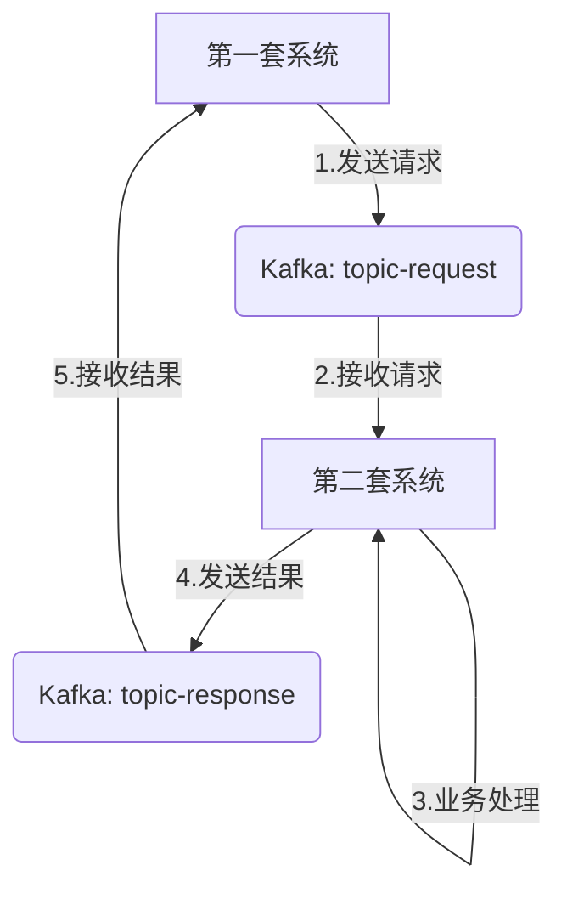

针对你提出的基于 Spring Boot 3 和 Kafka 的架构设计需求，这是一个非常经典的**“请求-响应”**（Request-Reply）或**“异步回调”**模式。

以下是针对你问题的详细分析以及完整的代码示例。

------

### 🧐 核心分析：第二套项目需要什么？

> **问题：** 第二套是否只需要生产者，把生产的消费发给下游进行处理，不需要消费者？

**回答：不对，第二套项目必须包含“消费者”和“生产者”。**

#### 原因分析

为了实现你描述的流程（第一套 -> 第二套 -> 第一套），数据流向必须是闭环的：

1. 第一套 (发起方)

   ：

   - **生产者**：发送请求数据到 `Topic A`。
   - **消费者**：监听 `Topic B`，接收第二套处理完的结果。

2. 第二套 (处理方)

   ：

   - **消费者**：**必须监听 `Topic A`**，否则它永远收不到第一套发来的数据。
   - **生产者**：处理完数据后，将结果发送到 `Topic B`。

**结论**：两套系统都需要同时具备生产者和消费者的能力。

------

### 🏗️ 架构设计概览

我们将定义两个 Topic：

- `topic-request`：第一套发给第二套（请求）。
- `topic-response`：第二套发给第一套（响应）。

**流程图解：**



------

### 🛠️ 环境准备 (application.yml)

两套项目共用一套 Kafka 环境，但可以使用不同的 `spring.application.name` 来区分消费者组（Consumer Group），这样消息不会被互相抢占。

**公共配置 (两套项目都适用):**

```yaml
spring:
  application:
    name: kafka-demo # 分别改为 project-1 和 project-2
  kafka:
    bootstrap-servers: localhost:9092 # 你的Kafka地址
    producer:
      key-serializer: org.apache.kafka.common.serialization.StringSerializer
      value-serializer: org.apache.kafka.common.serialization.StringSerializer
    consumer:
      group-id: ${spring.application.name}-group # 关键：使用应用名作为组名，确保两套系统互不干扰
      auto-offset-reset: earliest
      key-deserializer: org.apache.kafka.common.serialization.StringDeserializer
      value-deserializer: org.apache.kafka.common.serialization.StringDeserializer
```

------

### 💻 第一套项目代码 (发起方)

这套系统负责发起任务，并等待结果。

#### 1. 常量定义

```java
public class KafkaConstants {
    public static final String REQUEST_TOPIC = "topic-request";
    public static final String RESPONSE_TOPIC = "topic-response";
}
```

#### 2. 生产者 (发送请求)

```java
import org.springframework.kafka.core.KafkaTemplate;
import org.springframework.stereotype.Component;

@Component
public class RequestProducer {

    private final KafkaTemplate<String, String> kafkaTemplate;

    public RequestProducer(KafkaTemplate<String, String> kafkaTemplate) {
        this.kafkaTemplate = kafkaTemplate;
    }

    // 发送消息到第二套系统
    public void sendRequest(String message) {
        System.out.println("第一套系统发送请求: " + message);
        kafkaTemplate.send(KafkaConstants.REQUEST_TOPIC, message);
    }
}
```

#### 3. 消费者 (接收响应)

```java
import org.springframework.kafka.annotation.KafkaListener;
import org.springframework.stereotype.Component;

@Component
public class ResponseConsumer {

    // 监听第二套系统返回的 Topic
    @KafkaListener(topics = KafkaConstants.RESPONSE_TOPIC, groupId = "${spring.application.name}-group")
    public void listenResponse(String data) {
        System.out.println("第一套系统收到处理结果: " + data);
        // 在这里进行后续的业务逻辑，比如更新数据库状态等
    }
}
```

#### 4. 测试控制器

```java
import org.springframework.web.bind.annotation.GetMapping;
import org.springframework.web.bind.annotation.RequestParam;
import org.springframework.web.bind.annotation.RestController;

@RestController
public class Project1Controller {

    private final RequestProducer requestProducer;

    public Project1Controller(RequestProducer requestProducer) {
        this.requestProducer = requestProducer;
    }

    @GetMapping("/start-task")
    public String startTask(@RequestParam String msg) {
        requestProducer.sendRequest(msg);
        return "请求已发送，请等待回调...";
    }
}
```

------

### 💻 第二套项目代码 (处理方)

这套系统负责干活，干完活汇报。

#### 1. 常量定义 (与第一套保持一致)

```java
public class KafkaConstants {
    public static final String REQUEST_TOPIC = "topic-request";
    public static final String RESPONSE_TOPIC = "topic-response";
}
```

#### 2. 消费者 (接收请求) - **核心部分**

这里演示如何接收消息，处理，然后调用生产者。

```java
import org.springframework.kafka.annotation.KafkaListener;
import org.springframework.stereotype.Component;

@Component
public class RequestConsumer {

    private final ResponseProducer responseProducer;

    // 注入生产者，以便处理完后回发
    public RequestConsumer(ResponseProducer responseProducer) {
        this.responseProducer = responseProducer;
    }

    // 监听第一套系统发来的 Topic
    @KafkaListener(topics = KafkaConstants.REQUEST_TOPIC, groupId = "${spring.application.name}-group")
    public void listenRequest(String data) {
        System.out.println("第二套系统收到请求: " + data);
        
        // --- 模拟业务处理逻辑 ---
        String result = doBusinessLogic(data);
        // ----------------------

        System.out.println("第二套系统处理完成，准备返回结果");
        // 调用生产者将结果发回给第一套
        responseProducer.sendResponse(result);
    }

    private String doBusinessLogic(String input) {
        try {
            Thread.sleep(2000); // 模拟耗时操作
        } catch (InterruptedException e) {
            e.printStackTrace();
        }
        return "处理结果: [" + input + "] 已由第二套系统加工完成";
    }
}
```

#### 3. 生产者 (发送响应)

```java
import org.springframework.kafka.core.KafkaTemplate;
import org.springframework.stereotype.Component;

@Component
public class ResponseProducer {

    private final KafkaTemplate<String, String> kafkaTemplate;

    public ResponseProducer(KafkaTemplate<String, String> kafkaTemplate) {
        this.kafkaTemplate = kafkaTemplate;
    }

    // 发送结果回第一套系统
    public void sendResponse(String message) {
        kafkaTemplate.send(KafkaConstants.RESPONSE_TOPIC, message);
    }
}
```

------

### 💡 关键技术点总结

1. **Topic 的复用**：
   两套系统通过约定好的 `topic-request` 和 `topic-response` 进行通信。这就像两个人打电话，一个人说话（写Topic A），另一个人听话（读Topic A）；然后另一个人说话（写Topic B），第一个人听话（读Topic B）。
2. **Consumer Group (消费者组)**：
   在 `application.yml` 中，我特意配置了 `group-id: ${spring.application.name}-group`。
   - **第一套系统**的组名是 `project-1-group`。
   - **第二套系统**的组名是 `project-2-group`。
   - **重要性**：这保证了即使它们监听同一个 Topic，Kafka 也会认为它们是两个独立的订阅者，各自接收完整的消息流，而不是互相竞争消费消息。
3. **异步解耦**：
   第一套系统发送消息后不会阻塞等待（除非你使用了 `ReplyingKafkaTemplate` 做同步阻塞调用，但在微服务间通常推荐异步回调）。第一套系统发完就可以去干别的，等第二套系统处理完发回消息时，`@KafkaListener` 会自动触发处理。

### 🚀 如何运行测试

1. 启动 Kafka 服务。

2. 启动 **第二套项目**（确保它在监听 `topic-request`）。

3. 启动 **第一套项目**。

4. 访问第一套项目的接口：`GET http://localhost:8080/start-task?msg=HelloWorld`。

5. 观察控制台日志

   ：

   - 第一套打印：发送请求。
   - 第二套打印：收到请求 -> 处理中 -> 发送结果。
   - 第一套打印：收到处理结果。
